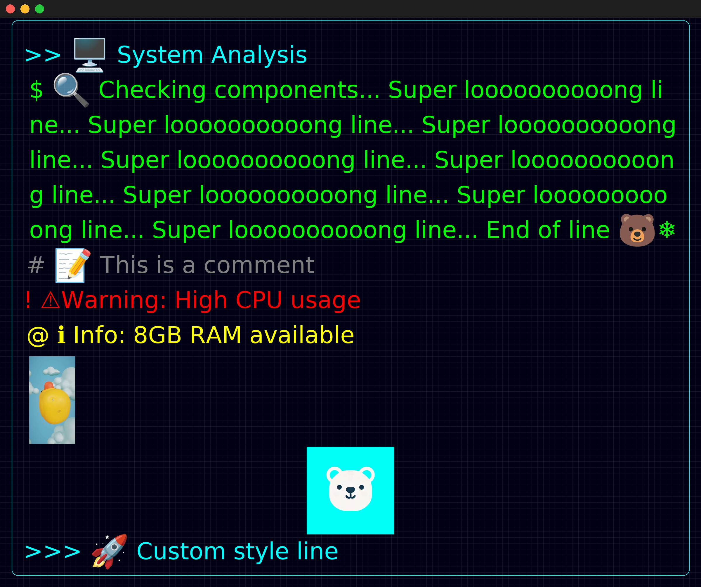

# CLI Style Renderer

## Overview
CLI Style Renderer is a Python script designed to generate command line styled images. Happy rendering!

## Features
- **Text Rendering**: Supports rendering of text with different prefixes (`>>`, `$`, `#`, `!`, `@`, `>>>`) to represent different styles (e.g., system messages, commands, comments, warnings, info).
- **Image Embedding**: Allows embedding images from local files or remote URLs into specific positions (e.g., left, center).
- **Customizable Styles**: Users can modify styles to match their needs, including fonts, colors, and background themes.
- **Lightweight**: Minimal dependencies and easy-to-extend design.


## Usage
```bash
git clone https://github.com/yourusername/cli-style-renderer.git
cd cli-style-renderer
python3 main.py
```

## Example Input
```python
lines = [
    ">> 🖥️ System Analysis",
    "$ 🔍 Checking components...",
    "# 📝 This is a comment",
    "! ⚠️ Warning: High CPU usage",
    "@ ℹ️ Info: 8GB RAM available",
    "img_left: https://pbs.twimg.com/ext_tw_video_thumb/1858064790821974016/pu/img/MQU4WFGD8vSyb_A2.jpg",
    "img_center: images/bear_ryan.png",
    ">>> 🚀 Custom style line"
]
```

## Example Output
The script processes the input lines and generates an image with the specified layout and styles. 


## Configuration
Styles and settings can be customized by modifying the `style_config.json` file:
```json
{
    ">>>": {
        "color": [255, 128, 0],
        "glow": true,
        "prefix": ">>>",
        "indent": 0
    }
}
```

## License
This project is licensed under the MIT License.